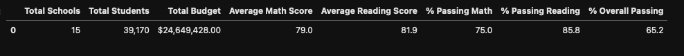
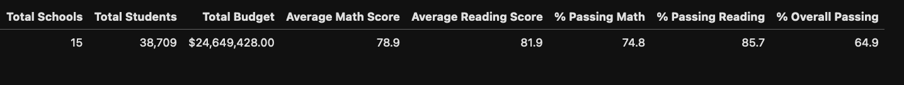
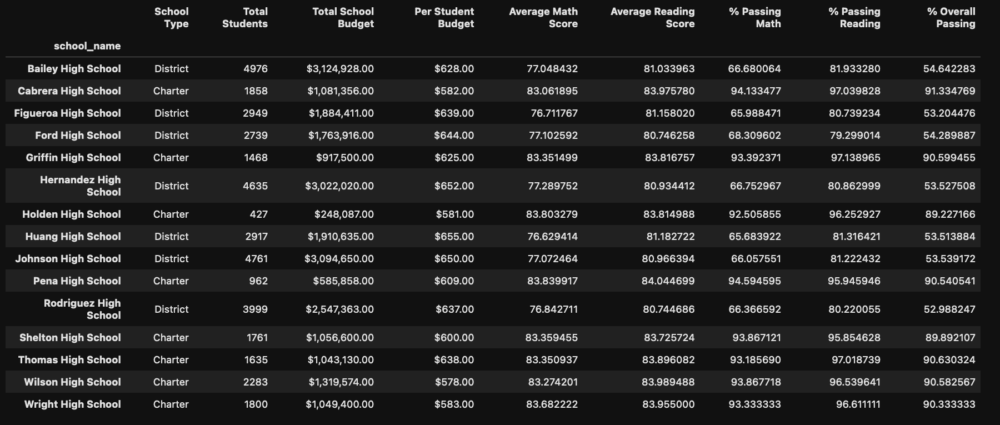
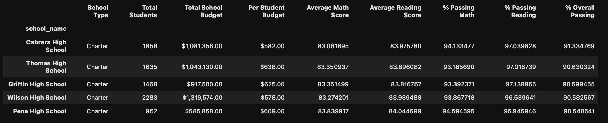
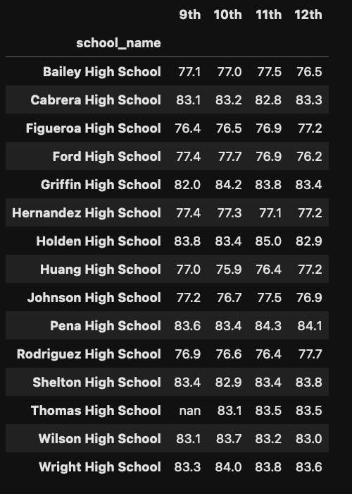
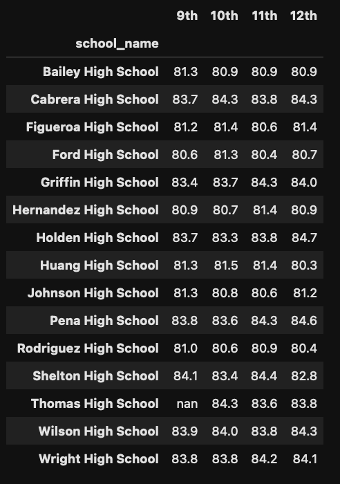

# School District Analysis

## Overview 

The following analysis of the school district, which includes: 

* a high-level summary of key metrics for the district as a whole
* these same high-level key metrics for each school in the district
* the top-5 and bottom-5 performing schools based on their overall passing rate
* the average math and reading scores by grade for each school
* performance based on budget per student
* performance based on the school size
* performance based on the type of school (Charter or District)

While this analysis was in flight, the school board notified us that the data showed potential evidence of academic disonesty. Reading and math grades for Thomas High School ninth-grade students may have been altered.  
As a result, we took efforts to exclude these test scores from our analysis. You will see this clarified in the **Deliverable 1** and **Deliverable 2** sections of `PyCitySchools_Challenge.ipynb` as well as below, in the [Results](#results) section of this `README`. 

## Results 

### Impact on the District Summary

At a glance, it appears there was not much of an impact on the District Summary. However, taking a closer look at the delta between the analyses, we see that further consideration might be warranted.

The change between District Summaries are as follows: 
* % Passing Math: -0.27%
* % Passing Reading: -0.12%
* % Overall Passing: -0.46%

Excluding a single high school's ninth-grade class amounted to nearly a half-percent change in the overall percentage of passing students **_district-wide_** could have significant implications for funding. 

See screenshots below. 

##### Compare the original analysis:

##### to the adjusted analysis: 

### Impact on the School Summary

At the school-level, the impact of excluding Thomas High School's ninth-grade test scores appears less than it was on the district as a whole. Here are the respective changes from the adjusted over the original analysis. 
* % Passing Math: -0.09%
* % Passing Reading: -0.30%
* % Overall Passing: -0.35%
 
Here is the School Summary for Thomas High School only. (top: adjusted analysis; bottom: original analysis)

Here is the final summary for all schools, with the Thomas High School ninth-grade test scores excluded:

### Impact on Thomas High School's Performance

When excluding ninth-grade test scores, Thomas High School still remained the **second-best** performer in the district. 

### Impact on Other Analyses

#### Math and Reading Scores by Grade

Math and reading scores by grade were not impacted, save for the new analysis only having `nan` in the place of test scores for '9th'. Since we were calculating means, `nan` is excluded. Other schools were not impacted.

##### Math Scores by Grade

##### Reading Scores by Grade

#### School Spending, School Size, and School Type

These analyses were largely unchanged. 

Thomas High School remained in these brackets, regardless of the changes we made to the test scores: $631-645 in spending per student, Medium-sized school, and Charter-type school.

##### Spending 
spending_summary.png

## Summary

1. The school district saw a -0.46% change in '% Overall Passing' data. 
2. Thomas High School saw a -0.35% change in '% Overall Passing' data.
3. We worked with a smaller population of Thomas High School students when calculating the percentages of passing students. 
4. Most analyses were _not_ impacted by replacing Thomas High School ninth-grade test scores with `nan`. Other schools were not directly impacted; as mentioned in #1, there was, of course, an indirect impact in the district-wide summary.
